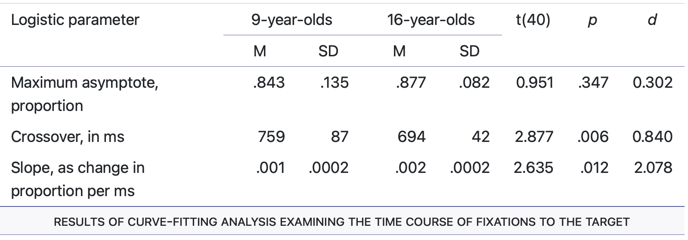
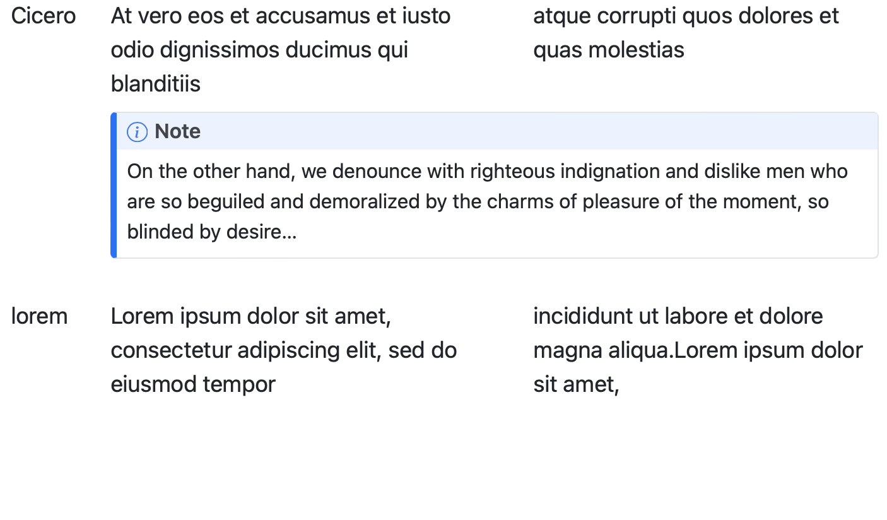
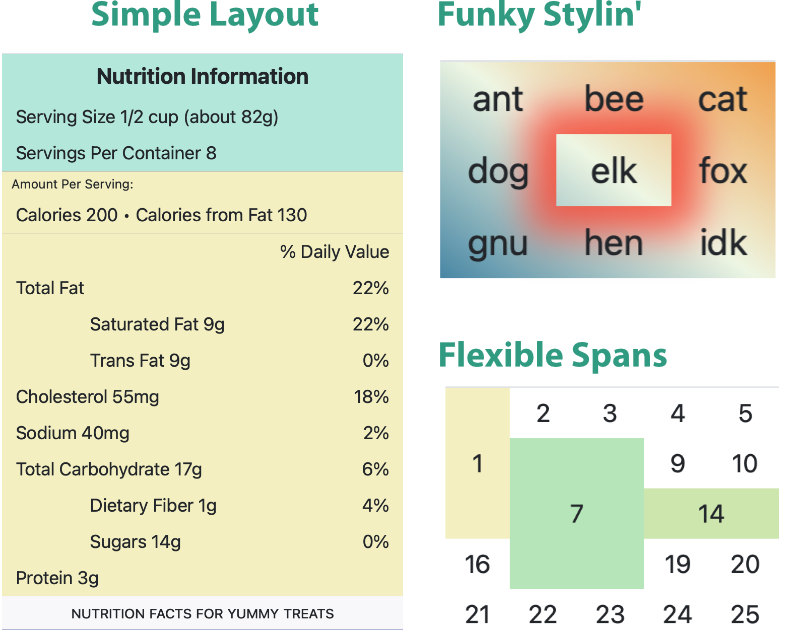
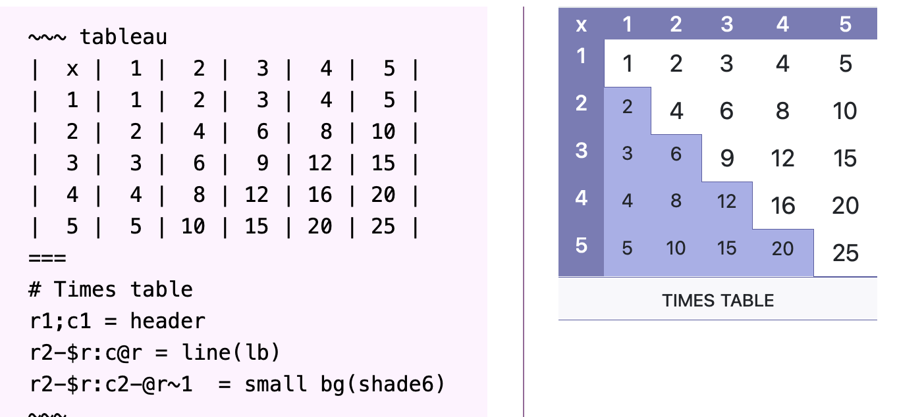

# Tableau: Enhanced Markdown Tables for Quarto

Tableau is a library that simplifies table layout by separating
data from layout. It is intended to be used as a preprocessor for
markup languages swuch as Markdown, but can be used standalone to
generate HTML.

Here are some sample tables:

* Easy spans, partial underlines

  

* Different heading styles
* Lines under every _n_ rows

  

* Block level cell content (single cell and spanned)

  

* Nontraditional layout

  

The layout language is vaguely dynamic. The following example shows the
markup on the left and the result on the right. The layout section uses
the special variables `$r` (the number of rows), and `$tr` (the current
row being generated). It also does arithmetic.



## Status

* HTML generation: working
* PDF generation:
  * prototype/poc working
  * development starting

## Cell Content

Tableau does not render Markdown inside cells itself -- it treats cell
content as opaque text and wraps it in a `<tableau-md>...</tableau-md>`
marker in its HTML output, with the content HTML-entity-escaped. This
keeps the library engine-agnostic: any postprocessor (a remark plugin, a
Quarto/Pandoc filter, or anything else consuming this HTML) is expected to
find `<tableau-md>` elements, HTML-unescape their contents, run its own
Markdown renderer over the result, and replace the element with the
rendered output.

`<tableau-md>` is a valid custom-element name and is otherwise inert --
plain HTML viewers will just show its (unescaped, unrendered) text
content. An empty cell produces an empty marker, `<tableau-md></tableau-md>`.

## Block Content

A data row can be followed by one or more `col N {{ ... }}` (or
`column N {{ ... }}`) blocks, each of which replaces the content of one
column of that row with a multi-line block of text, up to the matching
`}}`. `N` can be a column number (`col2`) or a letter (`colb`, equivalent
to column 2). The block's content is dedented by its own minimum common
leading whitespace, so you can indent it to match the surrounding markup
without that indentation ending up in the cell. A block that targets a
column outside the row's range is silently ignored.

```
Cicero|||
col2 {{
  paragraph one

  paragraph two
}}
```

## Styling in Host Environments

Host pages and site themes (Docusaurus, MkDocs, etc.) often apply their
own default table styling -- zebra striping, borders, shadows. The
shipped stylesheet (`assets/tableau.css`) resets `background`, `border`,
and `box-shadow` back to neutral values on `table.tableau` and its
`tr`/`th`/`td` descendants, using ordinary CSS specificity, not
`!important`. This beats most host default table styling on its own.

It won't beat a host theme that uses `!important` or unusually high
specificity for its own table styles. For those environments, a
host-specific integration package is expected to add whatever override
its environment needs (higher specificity, `!important`, or CSS `@layer`
ordering, depending on what fits that host).

## Documentation

A combined guide and reference [is available](https://pragdave.github.io/ts-tableau/).

## Preprocessors

Tableau itself only turns table markup into HTML (see [Cell
Content](#cell-content) above) -- something upstream still needs to feed
it that markup and hand its output to a Markdown/HTML pipeline. Known
preprocessors:

* [remark-tableau](https://github.com/pragdave/remark-tableau) -- a
  remark plugin that renders Tableau fenced code blocks for
  unified/remark-based toolchains (this is what generates the guide
  linked above).
* [pandoc-tableau](https://github.com/pragdave/pandoc-tableau) -- the
  original Pandoc/Quarto Lua filter version of Tableau, with its own
  markup syntax.

If you build a preprocessor for another toolchain, let me know and I'll
add it here.

## Installation

The Tableau extension is available in the `_extensions` directory.

## Adding to Your Document

This extension must be run prior to the bulk of Quarto processing. Add
it to your `_quarto.yml` file like this:

~~~ yml
filters:
  - _extensions/tableau_pre/tableau_pre.lua
  - quarto
  - other_filters_go_here
~~~

You'll need to add the `tableau_pre` extension at the top of your
filters, and then add the `- quarto` line (if it isn't already there).
This second line tells Quarto where in the filter chain it should run.

## Using

See [the guide](https://pragdave.github.io/ts-tableau/).

### License

Copyright © 2023, Dave Thomas (pragdave)

See [LICENSE.md](./LICENSE.md)
